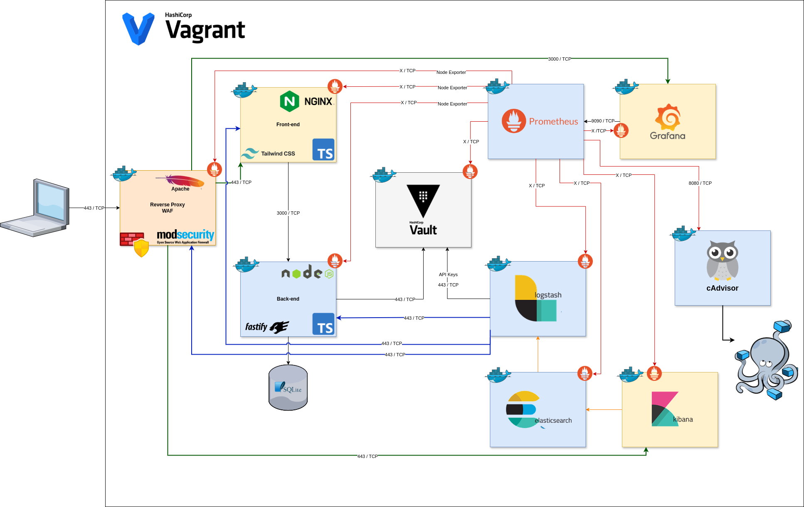
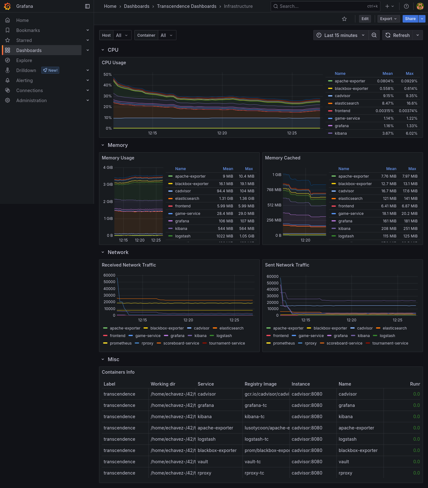
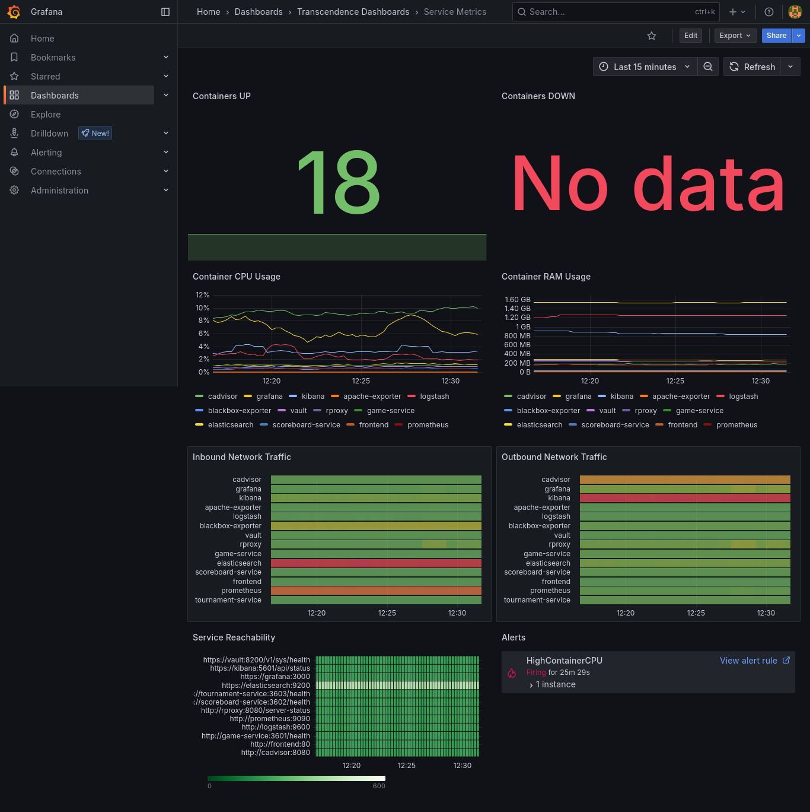
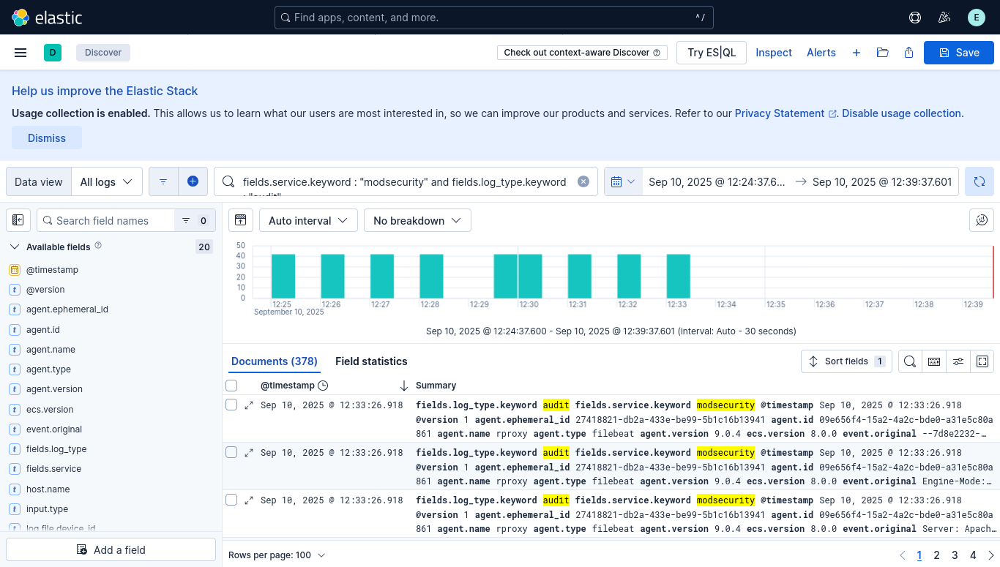
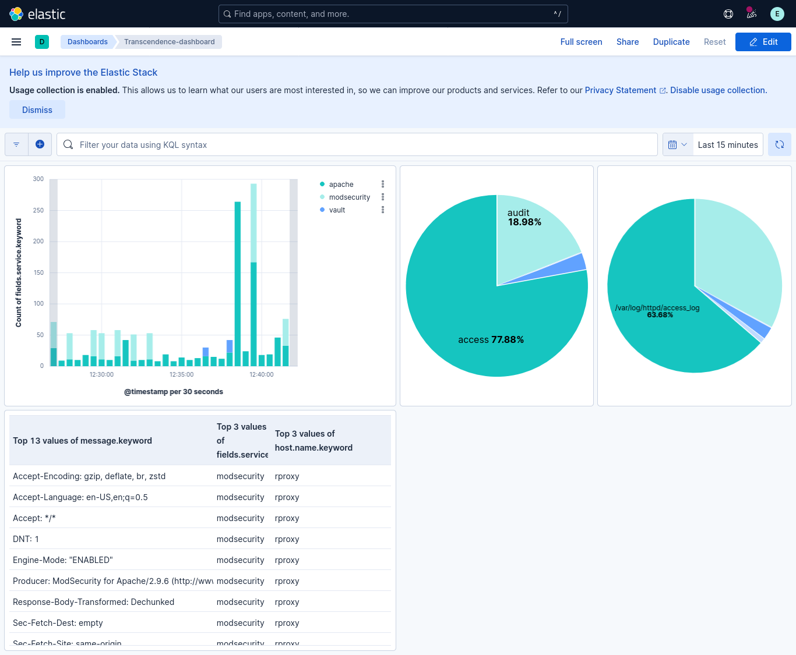
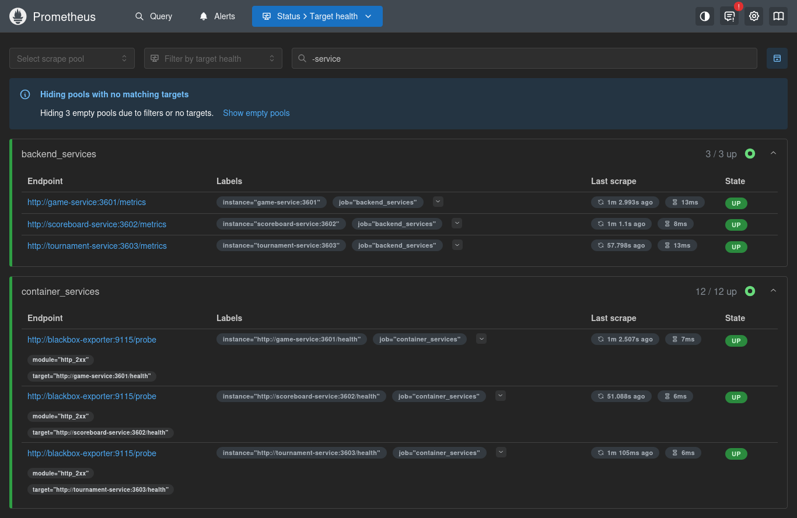
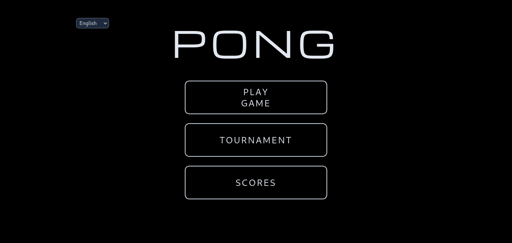
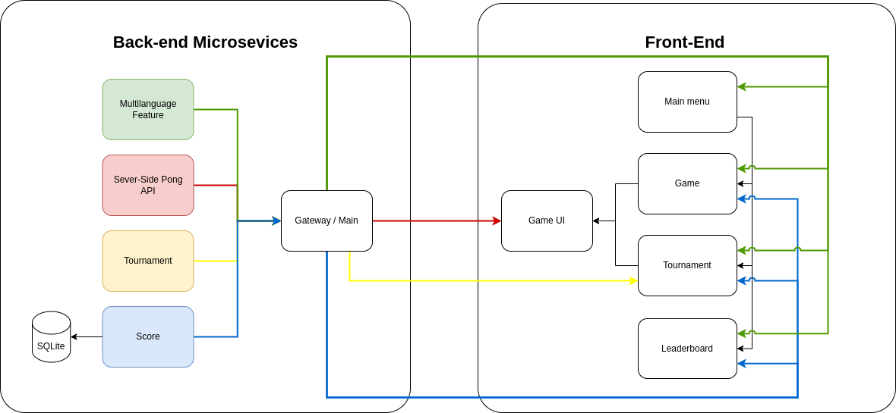
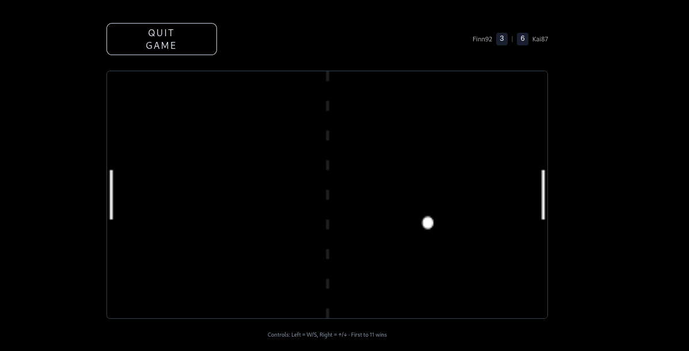
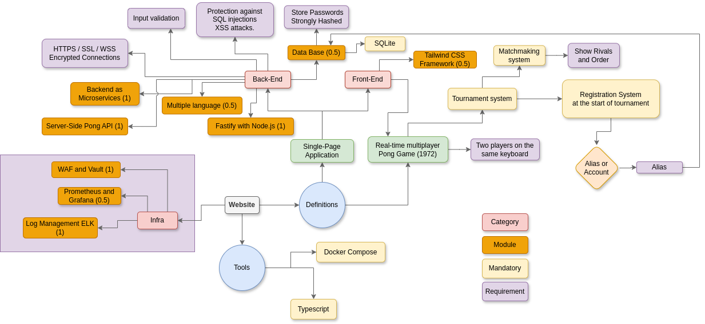

# Transcendence
<span>
  

  
  
  
  
  
  
  
  
  
  
  
  
  
  
  

</span>

## 📑 Table of Contents  

1. [Infrastructure Architecture](#infrastructure-architecture)  
2. [Project Structure](#project-structure)  
3. [Build & Deployment](#build-deployment)  
4. [Modules](#modules)  
   - [DevOps](#devops)
     - [Monitoring – Prometheus & Grafana](#prometheus-grafana)  
       - [Grafana Dashboards](#grafana-dashboards)
     - [ELK Stack – Log Management](#elk-stack)  
     - [Microservices](#microservices)  
   - [Cybersecurity](#cybersecurity)  
     - [WAF – ModSecurity](#waf-modsecurity)  
     - [Secrets Management – Hashicorp Vault](#vault)  
   - [Game Logic](#game-logic)  
     - [Server-Side Pong & API](#server-side-pong-api)  
   - [Web Development](#web-development) 

## Infrastructure Architecture



<a id="build-deployment"></a>
## 🚀 Build & Deployment

```bash
./setup_certs.sh
./setup_volumes.sh
docker compose up -d
# Add these domains to your /etc/hosts file for local testing
echo '42.fr rproxy.42.fr transcendence.42.fr pong.42.fr grafana.42.fr prometheus.42.fr vault.42.fr elastic.42.fr kibana.42.fr cadvisor.42.fr api-gateway.42.fr' | sudo tee -a /etc/hosts
```

## 🧩 Modules

> This project is structured into several modules, each focusing on different aspects:

## ⚙️ DevOps

<a id="prometheus-grafana"></a>
### Prometheus & Grafana – Monitoring system for infrastructure and services

[Prometheus](https://prometheus.io/) gathers metrics from services and infrastructure using various exporters and can trigger **alerts** based on defined rules, while [Grafana](https://grafana.com/) is used for visualizing these metrics through dashboards.

**Data exporters :**
- **cAdvisor** → container-level CPU, memory, disk, and network usage.
- **blackbox-exporter** → health probes on all services.
- **apache-exporter** → Apache reverse proxy metrics.
- **Fastify built-in metrics** → Each backend microservice (`game-service`, `scoreboard-service`, `tournament-service`) exposes Prometheus metrics (`/metrics` endpoint).

<a id="grafana-dashboards"></a>
**Grafana dashboards :**
- **Infrastructure Dashboard :** container resource usage, uptime, node metrics.
- **Service Metrics Dashboard :** latency, error rates, throughput for microservices (via Fastify metrics), HTTP success/failure ratios, and exporter data.

📈 **Infrastructure Dashboard :**



📊 **Service Metrics Dashboard :**



<a id="elk-stack"></a>
### ELK Stack – Log Management Infrastructure

**Log collection** is handled by [Filebeat](https://www.elastic.co/docs/reference/beats/filebeat/) from multiple services such as :
  - Apache reverse proxy (access/error logs).
  - WAF (ModSecurity logs).
  - Vault audit logs.

This are the logs collected with filebeat, processed through [Logstash](https://www.elastic.co/logstash/), indexed in [Elasticsearch](https://www.elastic.co/elasticsearch/) and visualized in [Kibana](https://www.elastic.co/kibana/) :



This is a dashboard in Kibana from the collected logs :



<a id="microservices"></a>
### Backend as Microservices (Architecture)

**Microservices implemented :**
- `game-service` (port 3601).
- `scoreboard-service` (port 3602, with persistent volume for data).
- `tournament-service` (port 3603).

**Design :**
- Each runs as its own container, isolated and restart-managed.
- RESTful APIs (example:  `/health` and `/metrics` endpoints.)
- Communication via shared `transcendence-network`.
- Independent deployment and scaling, monitored individually.

This image is from Prometheus showing the microservices and exporters being monitored :



<a id="cybersecurity"></a>
## 🛡️ Cybersecurity

<a id="waf-modsecurity"></a>
### WAF – ModSecurity with Hardened Configuration 
  - [ModSecurity](https://modsecurity.org/)  

<a id="vault"></a>
### HashiCorp Vault – Secrets Management
  - [HashiCorp Vault](https://www.vaultproject.io/)

<a id="game-logic"></a>
## 🏓 Game Logic

<a id="server-side-pong-api"></a>
### Server-side Pong & API – Replace basic Pong with server-side Pong and implement an API

<a id="web-development"></a>
## 💻 Web Development  

The website is composed by these technologies :  

- **Backend:** [Fastify](https://fastify.dev/) with Node.js  
- **Frontend:** [Tailwind CSS](https://tailwindcss.com/) for styling  
- **Database:** [SQLite](https://www.sqlite.org/) as a lightweight storage solution  

---

## Website



### Back - Front Communication Diagram



### Base of the Website

| Component  | Requirements |
|------------|-------------|
| **Back-end** | The website may or may not include a back-end. If used, it must be implemented in PHP unless the Framework module is selected. If a database is used, it must comply with the Database module rules. |
| **Front-end** | The base language must be TypeScript, with possible modifications using the Front-end module. |
| **Navigation** | The website must function as a single-page application (SPA). Users should be able to navigate using the browser’s back and forward buttons. |
| **Browser Compatibility** | Full compatibility with the latest stable version of Firefox is required. |
| **Error Handling** | The website must be free of errors and warnings during usage. |
| **Deployment** | The entire website must be containerized with Docker and launchable via a single command. |

## Base of the Pong Game



| Feature | Requirements |
|---------|-------------|
| **Gameplay** | Players must be able to compete in real-time on the same keyboard. Remote multiplayer functionality can be expanded with the Remote Players module. |
| **Tournament System** | The game must support a tournament mode where multiple players take turns competing. The system should display matchups and the order of play. |
| **Player Registration** | Players must enter an alias before the tournament begins. Aliases reset when a new tournament starts. This can be enhanced with the Standard User Management module. |
| **Matchmaking** | The tournament system must handle participant matchmaking and announce upcoming matches. |
| **Fair Play** | All players must follow the same rules, including identical paddle speeds. If an AI opponent is used, it must have no unfair advantages. The game’s aesthetic should align with the original Pong while allowing customization. |

## Security of the Website

| Security Aspect | Requirements |
|-----------------|-------------|
| **Password Security** | User passwords must be securely hashed using a strong cryptographic algorithm. |
| **Protection Against Attacks** | The website must be safeguarded against SQL Injection and XSS vulnerabilities. |
| **Secure Communication** | If a back-end is implemented, HTTPS must be enforced across all communications, including WebSockets (wss). |
| **Input Validation** | All user inputs must undergo validation, either client-side (if no back-end) or server-side when applicable. |
| **API Security** | If an API is implemented, all routes must be secured. Even without JWT authentication, adequate security measures must be in place. |
| **Environment Configuration** | Sensitive credentials must be stored in a `.env` file and excluded from version control. |


## Project Structure


