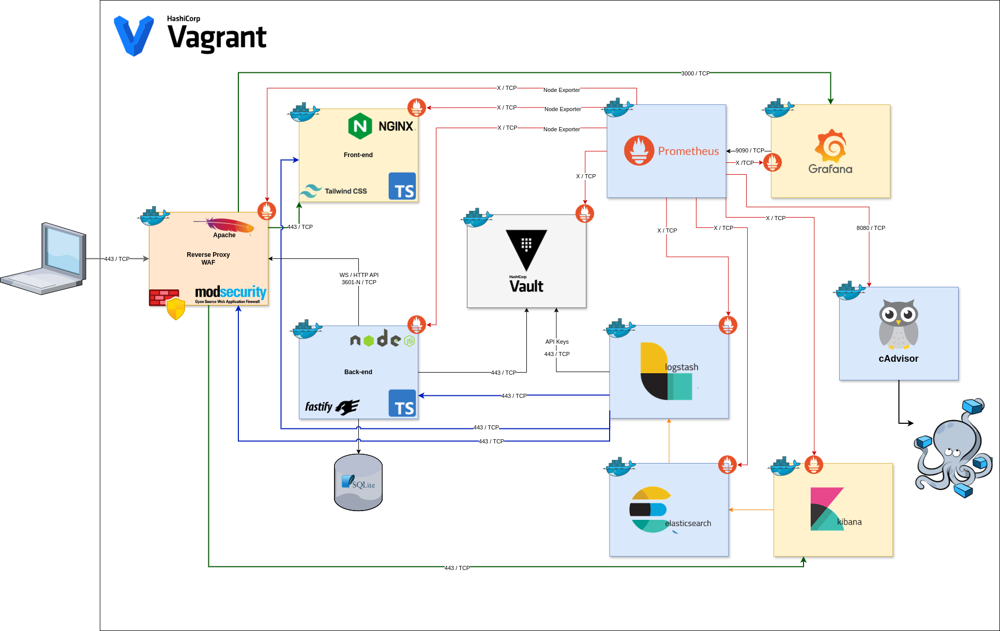

# Transcendence
<span>
  

  
  
  
  
  
  
  
  
  
  
  
  
  
  
  

</span>

## 📑 Table of Contents  

1. [Infrastructure Architecture](#infrastructure-architecture)  
2. [Project Structure](#project-structure)  
3. [Build & Deployment](#build--deployment)  
4. [Modules](#modules)  
   - [DevOps](#devops)
     - [Monitoring – Prometheus & Grafana](#monitoring--prometheus--grafana)  
     - [ELK Stack](#elk-stack)  
     - [Microservices](#microservices)  
   - [Cybersecurity](#cybersecurity)  
     - [WAF – ModSecurity](#waf--modsecurity)  
     - [Secrets Management – Hashicorp Vault](#secrets-management--vault)  
   - [Game Logic](#game-logic)  
     - [Server-Side Pong & API](#server-side-pong--api)  
   - [Web Development](#web-development) 
5. [Bonus Modules](#bonus-modules) 

## Infrastructure Architecture



## Project Structure


## 🚀 Build & Deployment

```bash
./setup_certs.sh
./setup_volumes.sh
docker compose up -d
```

## Modules

> This project is structured into several modules, each focusing on different aspects:

## DevOps

### ELK Stack – Infrastructure setup with ELK for log management (Major)  
  - [Elasticsearch](https://www.elastic.co/elasticsearch/)  
  - [Logstash](https://www.elastic.co/logstash/)  
  - [Kibana](https://www.elastic.co/kibana/)
### Monitoring system – Add a system to monitor infrastructure and services (Minor)  
  - [Prometheus](https://prometheus.io/)  
  - [Grafana](https://grafana.com/)
### Microservices – Design the backend as microservices (Major)

## Cybersecurity

### WAF & Vault – Implement WAF/ModSecurity with Hardened Configuration and HashiCorp Vault for Secrets Management (Major)  
  - [ModSecurity](https://modsecurity.org/)  
  - [HashiCorp Vault](https://www.vaultproject.io/)

## Server-Side Pong & API

### Server-side Pong & API – Replace basic Pong with server-side Pong and implement an API (Major)

## Web Development  

The website is composed by:  

- **Backend:** [Fastify](https://fastify.dev/) with Node.js  
- **Frontend:** [Tailwind CSS](https://tailwindcss.com/) for styling  
- **Database:** [SQLite](https://www.sqlite.org/) as a lightweight storage solution  

---

## Website

### Back - Front Communication Diagram


### Base of the Website

| Component  | Requirements |
|------------|-------------|
| **Back-end** | The website may or may not include a back-end. If used, it must be implemented in PHP unless the Framework module is selected. If a database is used, it must comply with the Database module rules. |
| **Front-end** | The base language must be TypeScript, with possible modifications using the Front-end module. |
| **Navigation** | The website must function as a single-page application (SPA). Users should be able to navigate using the browser’s back and forward buttons. |
| **Browser Compatibility** | Full compatibility with the latest stable version of Firefox is required. |
| **Error Handling** | The website must be free of errors and warnings during usage. |
| **Deployment** | The entire website must be containerized with Docker and launchable via a single command. |

## Base of the Pong Game

| Feature | Requirements |
|---------|-------------|
| **Gameplay** | Players must be able to compete in real-time on the same keyboard. Remote multiplayer functionality can be expanded with the Remote Players module. |
| **Tournament System** | The game must support a tournament mode where multiple players take turns competing. The system should display matchups and the order of play. |
| **Player Registration** | Players must enter an alias before the tournament begins. Aliases reset when a new tournament starts. This can be enhanced with the Standard User Management module. |
| **Matchmaking** | The tournament system must handle participant matchmaking and announce upcoming matches. |
| **Fair Play** | All players must follow the same rules, including identical paddle speeds. If an AI opponent is used, it must have no unfair advantages. The game’s aesthetic should align with the original Pong while allowing customization. |

## Security of the Website

| Security Aspect | Requirements |
|-----------------|-------------|
| **Password Security** | User passwords must be securely hashed using a strong cryptographic algorithm. |
| **Protection Against Attacks** | The website must be safeguarded against SQL Injection and XSS vulnerabilities. |
| **Secure Communication** | If a back-end is implemented, HTTPS must be enforced across all communications, including WebSockets (wss). |
| **Input Validation** | All user inputs must undergo validation, either client-side (if no back-end) or server-side when applicable. |
| **API Security** | If an API is implemented, all routes must be secured. Even without JWT authentication, adequate security measures must be in place. |
| **Environment Configuration** | Sensitive credentials must be stored in a `.env` file and excluded from version control. |


